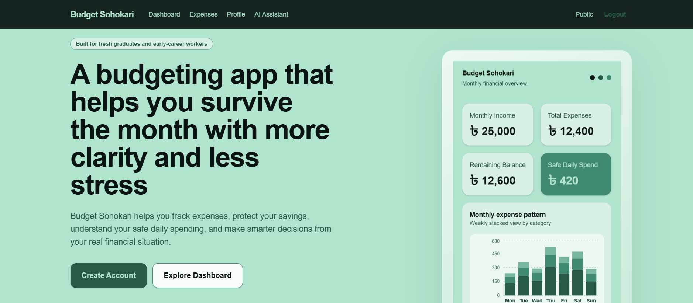

# Budget Sohokari

**Live Demo:** https://budget-sohokari.vercel.app/

Budget Sohokari is a full-stack personal budgeting application built for fresh graduates and early-career professionals who need a simple, practical way to track expenses, protect savings, and understand safe day-to-day spending.

The product is designed around a real problem: managing an entry-level income without relying on overly complex finance tools.

## Overview

This project was built as a production-style web application rather than a static portfolio piece. It includes authentication, protected routes, database-backed user data, analytics, PDF export, and a guest demo experience that allows recruiters and first-time visitors to explore the product without creating an account.

## Why This Project Stands Out

- Built with **Next.js 16 App Router**
- Full-stack application with frontend, backend, database, and authentication
- JWT-based authentication with HTTP-only session cookies
- Protected routes with server-side session checks
- Database-backed expense tracking and user budgeting data
- Monthly analytics and actionable budgeting insights
- Savings goal tracking and safe daily spending guidance
- PDF export for expense reports
- Public demo experiences for easier evaluation without login friction
- Responsive UI for desktop and mobile devices

## Core Features

### Authentication
- JWT-based login and signup flow
- Session token stored in secure HTTP-only cookies
- Protected routes using middleware and server-side validation

### Expense Management
- Create, edit, and delete expenses
- Categorize transactions
- Review expense history in a structured table

### Budget Insights
- Monthly income, total expenses, and remaining balance
- Safe daily spending calculation
- Savings goal progress tracking
- Monthly planning guidance

### Analytics
- Category-level spending breakdown
- Day-by-day expense analysis
- Top spending category
- Highest spending day
- Average daily spending
- No-spend day insights

### PDF Export
- Downloadable PDF expense reports using `@react-pdf/renderer`

### Demo-Friendly Experience
To make the project easier to review:

- `/dashboard` displays a realistic demo dashboard when no user is logged in
- `/expenses` displays sample transactions, analytics, and PDF export in read-only mode

This allows recruiters, hiring managers, and collaborators to understand the product quickly without creating an account first.

## Tech Stack

### Frontend
- Next.js 16
- React 19
- TypeScript

### Styling
- Tailwind CSS 4

### Backend
- Next.js Route Handlers

### Database
- MongoDB
- Mongoose

### Authentication
- JWT
- HTTP-only cookies

### Data Visualization
- Recharts

### PDF Export
- `@react-pdf/renderer`

## Product Preview

### Dashboard
The dashboard helps users understand their financial position at a glance.

It includes:
- Monthly income
- Total expenses
- Remaining balance
- Safe daily spending guidance
- Savings goal progress
- Category-wise spending breakdown
- Recent expenses
- Monthly planning notes

### Expenses Page
The expenses page focuses on transaction management and analytics.

It includes:
- Expense entry form
- Expense table with edit and delete actions
- Monthly analytics summary
- Daily expense breakdown
- PDF report export

